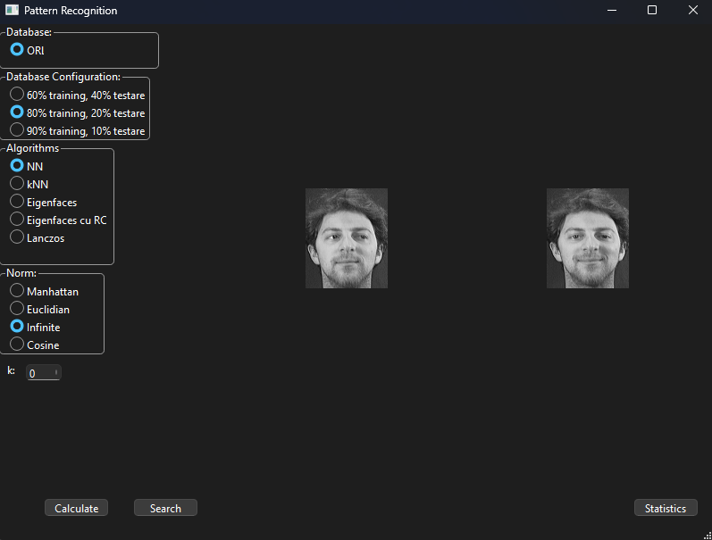
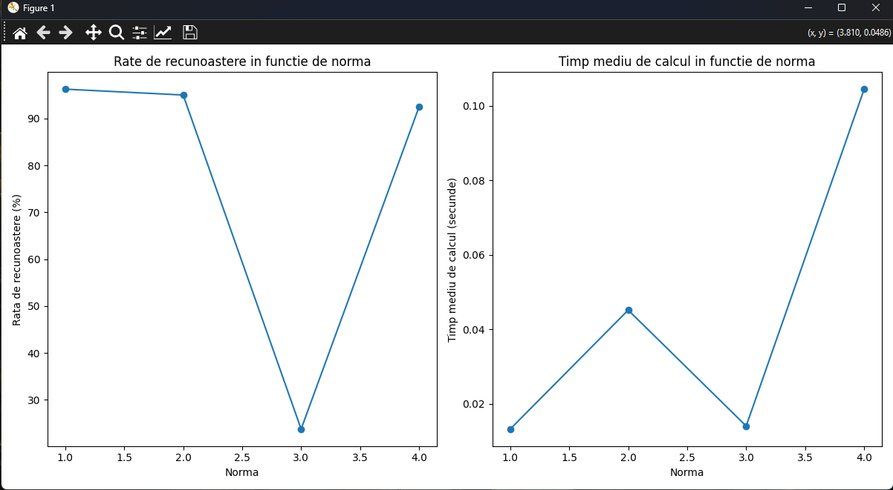
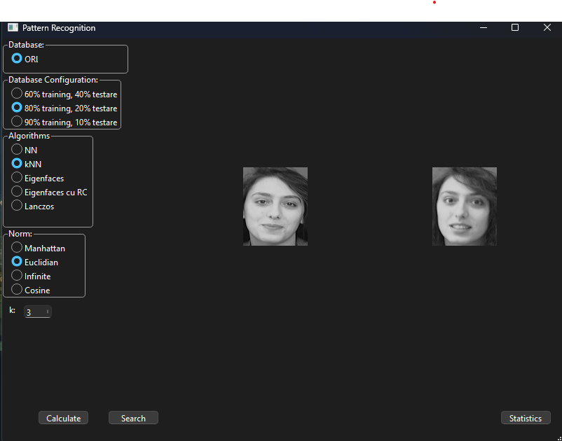
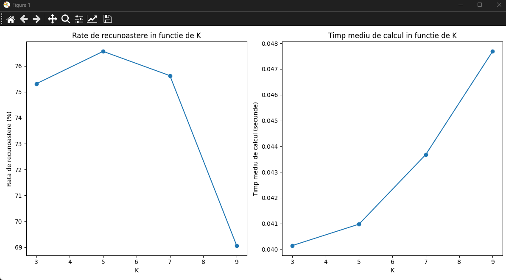
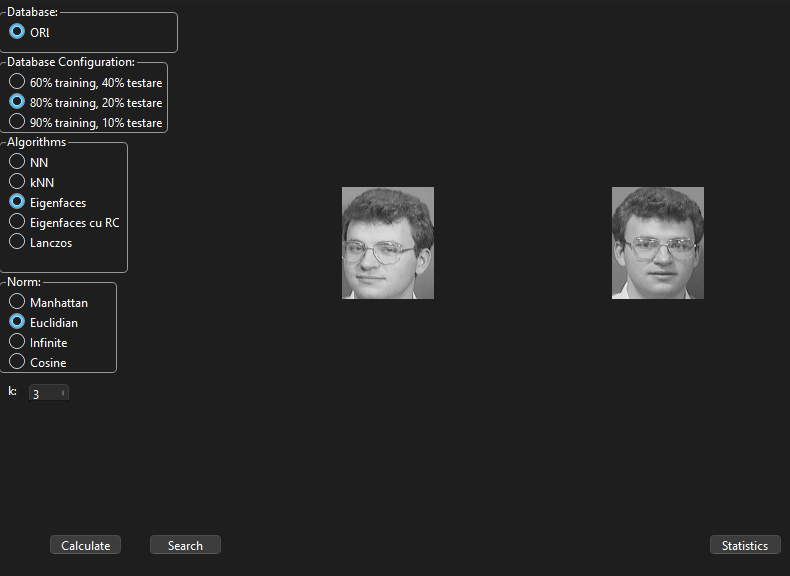
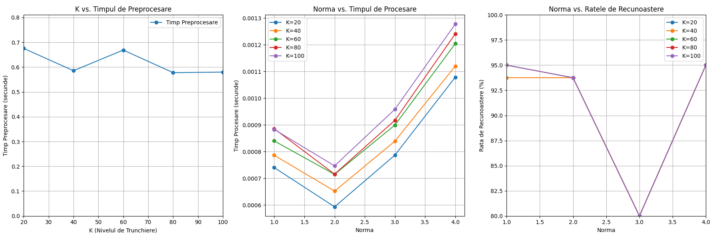
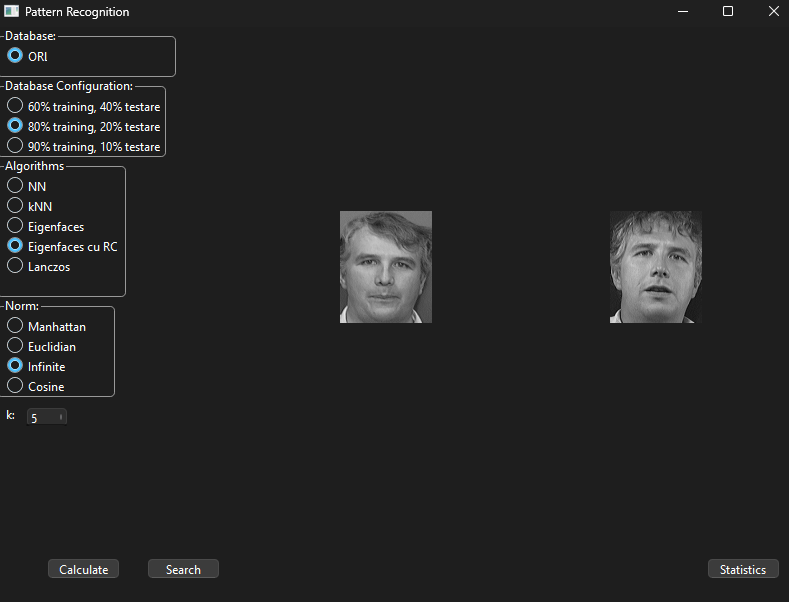
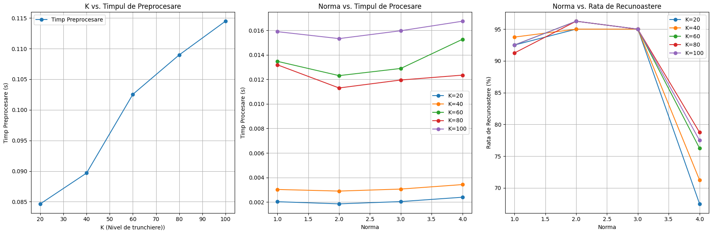
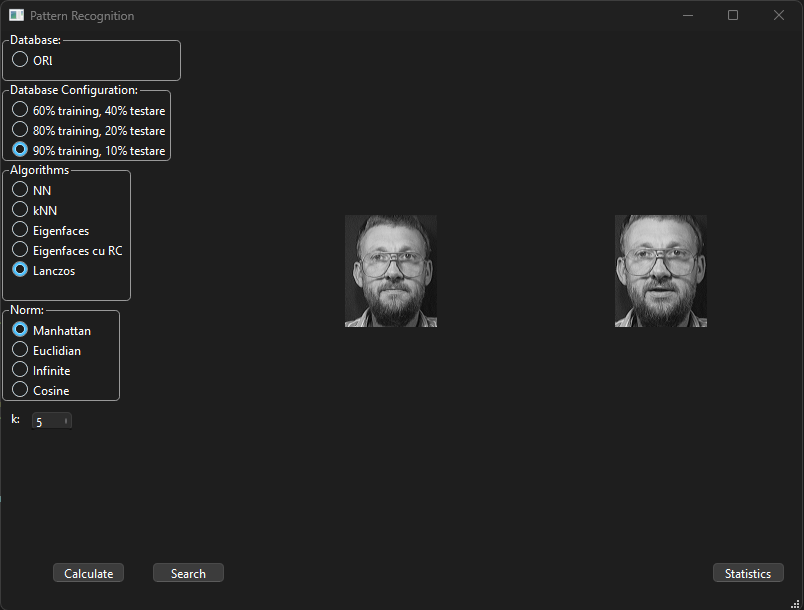
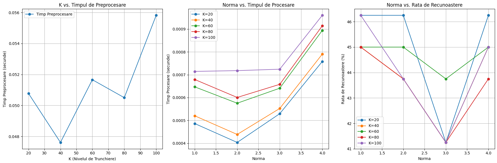

# 🧠 Face Recognition App

A **Python-based facial recognition system** built with **PyQt6**, **OpenCV**, and **NumPy**, implementing multiple algorithms for identifying and comparing human faces.  
The project allows testing and visualizing methods like **Nearest Neighbor (NN)**, **k-Nearest Neighbors (k-NN)**, **Eigenfaces**, **Class Representatives**, and **Lanczos Algorithm** using the **AT&T (ORL) Face Database**.

---

## 📚 Table of Contents
1. [Overview](#-overview)  
2. [Features](#-features)  
3. [Requirements](#-requirements)  
4. [Dataset](#-dataset)  
5. [Algorithms](#-algorithms)  
   - [Nearest Neighbor (NN)](#1-nearest-neighbor-nn)  
   - [k-Nearest Neighbors (k-NN)](#2-k-nearest-neighbors-k-nn)  
   - [Eigenfaces](#3-eigenfaces)  
   - [Class Representatives](#4-class-representatives)  
   - [Lanczos Algorithm](#5-lanczos-algorithm)  
6. [Results & Statistics](#-results--statistics)  
7. [Conclusion](#-conclusion)

---

## 🧭 Overview

This application provides a graphical environment for experimenting with different **face recognition algorithms**.  
It allows users to select datasets, test recognition accuracy, compare multiple distance metrics (Manhattan, Euclidean, Infinite Norm, and Cosine Similarity), and visualize results interactively.

The interface was designed in **PyQt6**, and all visualizations are displayed using **Matplotlib**.

---

## ⚙️ Features

- 🖼️ **PyQt6-based GUI** for easy use  
- 🧠 **Multiple recognition algorithms** (NN, k-NN, Eigenfaces, etc.)  
- 📊 **Statistical analysis** of accuracy and speed  
- 📈 **Visualization of results** with Matplotlib  
- ⚙️ **Configurable parameters:** distance metrics, training percentage, and truncation levels  

---

## 🧩 Requirements

Install all dependencies using:

```bash
pip install -r requirements.txt
```
The requirements.txt file should include: PyQt6,
opencv-python,
numpy,
matplotlib,
scipy

---

## 📁 Dataset

The application uses the AT&T (ORL) Face Database, containing:
- 40 subjects
- 10 grayscale images per person
- Resolution: 112x92 pixels
- Format: `.pgm`

---

## 🧠 Algorithms

### 1. Nearest Neighbor (NN)

Finds the closest training image to the input face using selected distance metrics.

**Interface:**



**Performance**



### 2. k-Nearest Neighbors (k-NN)

Considers the k closest images and classifies by majority voting.
Supports Manhattan, Euclidean, Infinity, and Cosine norms.

**Interface:**



**Performance**



### 3. Eigenfaces

Uses Principal Component Analysis (PCA) to reduce dimensionality and represent faces in eigenspace.
Then applies NN or k-NN for classification.

**Interface:**



**Performance**



### 4. Class Representatives

Each class (person) has its own mean and eigenspace representation.
The test image is projected into each class and classified by the smallest distance.

**Interface:**



**Performance**



### 5. Lanczos Algorithm

Improves eigenface computation efficiency using the Lanczos iteration method for finding dominant eigenvectors.

**Interface:**



**Performance**



## 📊 Results & Statistics

The system supports testing on multiple dataset configurations (e.g., 60%, 80% training splits).
Performance varies with:
- Algorithm type
- Distance metric
- Number of training images per class

## 📝 Conclusion

This project demonstrates how various face recognition algorithms can be compared and optimized in terms of accuracy and speed.
It provides an educational and practical framework for understanding pattern recognition, dimensionality reduction, and statistical classification through an intuitive graphical interface.
